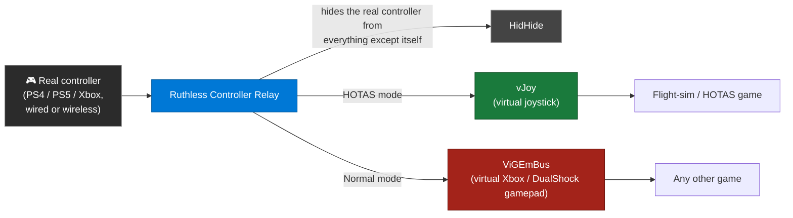
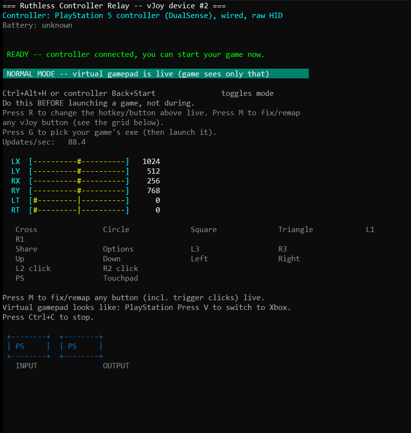

<div align="center">

# Ruthless Controller Relay

**Use a PlayStation or Xbox controller as a real HOTAS-style joystick — or a clean, reliable regular gamepad — in any Windows game.**

Full rumble, lightbar/LED color, and battery reporting, wherever the hardware and connection type genuinely allow it.

[](#)
[](src/hotas_relay.c)
[](https://ziglang.org/)
[](LICENSE)

[Quick start](#quick-start) · [Controls](#controls) · [Compatibility](#what-works-and-what-doesnt) · [Is this safe?](#is-this-safe-to-run) · [Building](#building-from-source) · [Development story](docs/DEVELOPMENT_JOURNEY.md) · [Credits](#credits)

</div>

---

## The problem this solves

Flight sims, space sims, and other HOTAS-style games bind their controls to a real **joystick** device — a flight stick, a throttle, a yoke. A gamepad isn't one of those, and Windows treats "gamepad" and "joystick" as genuinely different device classes, not just a labeling difference. If you don't own a real HOTAS setup and want to fly with a PS4/PS5 or Xbox controller instead, there was no clean, single tool that could present it as a virtual joystick to that one flight sim, while still behaving like a normal controller everywhere else — switchable live, with no reboot and no unplug/replug.

## How it works

This tool sits between your real controller and every game on the system:



Exactly one virtual device is ever "live" at a time — the other one is present but muted, never added or removed on the fly, since neither HidHide nor games handle live device changes reliably. Rumble, LED color, and battery level flow the other direction: read back from the virtual device and forwarded to the real controller, wherever the connection type allows it (see [compatibility](#what-works-and-what-doesnt) below).

<p align="center"></p>

<p align="center"><sub>The live dashboard — real-time axis/button state, current mode, and what the game sees vs. what's actually plugged in.</sub></p>

Three separate pieces of driver engineering make this possible — **[vJoy](https://github.com/shauleiz/vJoy)**, **[ViGEmBus](https://github.com/nefarius/ViGEmBus)**, and **[HidHide](https://github.com/nefarius/HidHide)** — all built and maintained by other people. See [Credits](#credits).

## Quick start

1. Download the latest build from [Releases](../../releases), or [build it yourself](#building-from-source).
2. Run `RuthlessControllerRelay.exe`. On first run it self-installs vJoy/HidHide/ViGEmBus if they aren't already present (see [how and why](docs/DEVELOPMENT_JOURNEY.md#core-architecture)).
3. Connect a controller — the dashboard shows what it detected and what it's currently presenting to games.
4. Press `Ctrl+Alt+H` (or the controller-side combo shown on the dashboard) to switch between **HOTAS mode** and **Normal mode**.

For a plain-English "is this working right now" guide with no jargon, see the **[Compatibility Cheat Sheet (PDF)](docs/Controller_Compatibility_Cheat_Sheet.pdf)**.

### Controls

| Key | Does |
|---|---|
| `Ctrl+Alt+H` <br/><sub>(or the controller combo shown on-screen)</sub> | Switch between HOTAS mode and Normal mode |
| `V` | Flip the virtual output between PlayStation-style and Xbox-style |
| `R` | Change the hotkey/button combo for the mode switch above |
| `M` | Remap a button |
| `G` | Pick/launch a game |

**The controller-side default depends on what's plugged in the first time you ever run it**: a PlayStation controller defaults to the PS button alone, and an Xbox controller defaults to the **Guide/Xbox-logo button** — confirmed working on real hardware, including through the official Xbox Wireless Adapter dongle. Neither button ever reaches whatever the game sees, so it can't collide with anything the game itself does. This is decided once, the very first time a controller connects on a fresh install, and never overwritten afterward — change it any time with `R`, or by hand-editing `button=` in `ruthless_controller_relay.ini` (e.g. `button=back+start` for the classic combo instead). Full story, including why the newer Share button doesn't get the same treatment, in [Known Limitations](docs/KNOWN_LIMITATIONS.md#the-xboxguide-button--solved-and-confirmed-on-real-hardware).

**If you use Steam, two separate Steam settings can each independently break this software, and both need checking — this isn't optional:**
- **Steam Input** intercepts your controller directly for any game it's active on, which can make the real controller reach the game no matter what this software or HidHide does underneath it. Turn it off for the specific game: Steam Library → right-click the game → Properties → Controller → set "Override for \<game\>" to **Disable Steam Input** (or turn it off globally in Steam Settings → Controller if you don't use Steam Input anywhere).
- **"Guide Button Focuses Steam"** is a separate setting that only affects the Guide-button mode toggle specifically (see above) — Steam Settings → Controller → General Controller Settings.
Both can be on at the same time and cause different-looking problems; check both if anything seems to be reading the real controller or the Guide button isn't toggling modes.

When the PS button (or touchpad) is configured as the toggle specifically, it's deliberately never also forwarded as a normal vJoy button at the same time — so it can't do double duty as both a mode-switch and a bound joystick action. (This doesn't apply to standard buttons like Back+Start, which keep working as ordinary vJoy buttons even while also serving as the toggle combo — unchanged, long-standing behavior.)

## What works and what doesn't

Full plain-English matrix, connection by connection: **[Controller Compatibility Cheat Sheet (PDF)](docs/Controller_Compatibility_Cheat_Sheet.pdf)**.

| Controller | Connection | Input | Rumble / LED / Battery |
|---|---|:---:|:---:|
| PlayStation (DS4 / DualSense) | USB cable | ✅ | ✅ |
| PlayStation (DS4 / DualSense) | Bluetooth | ✅ | ❌ — [see why](docs/KNOWN_LIMITATIONS.md#bluetooth-playstation-controller-rumble-and-led-output) |
| Xbox | Wireless dongle | ✅ | ✅ |
| Xbox | USB cable | ✅ (normal play) | ⚠️ HOTAS mode unreliable — [see why](docs/KNOWN_LIMITATIONS.md#wired-xbox-controllers-cant-be-hidden-from-other-apps) |

Both limitations above are genuine Windows/hardware constraints, investigated in depth rather than assumed — the linked sections explain exactly why, and what was tried.

**HOTAS mode and force feedback:** flying with a HOTAS setup currently gets no vibration/force feedback from the sim itself — Normal-mode rumble (the row above) is unaffected either way. Real DualSense/DualShock HD-haptic force feedback is planned for a future release; see [issue #10](https://github.com/spongebobmoviept-lab/RuthlessControllerRelay/issues/10) for current status.

## Is this safe to run?

Yes, for the overwhelming majority of games and use cases. This is worth explaining properly rather than just linking a warning, because "installs drivers" understandably sounds scarier than it is:

- **The three drivers this uses are not obscure or homemade.** vJoy, ViGEmBus, and HidHide are all Microsoft WHQL-signed (verified via `Get-AuthenticodeSignature` — real code-signing, not a self-signed or unsigned package), and all three have been in wide, everyday use for years. ViGEmBus and HidHide together are the same foundation [DS4Windows](https://github.com/Ryochan7/DS4Windows) runs on, a tool with a massive install base among PlayStation-controller-on-PC users. vJoy specifically predates this whole project by a decade and is the de facto standard virtual joystick across the entire flight-sim and sim-racing community — if you've ever mapped a gamepad to a flight stick for a sim, there's a good chance vJoy was already involved.
- **This is exactly what HOTAS-expecting games actually want.** A flight sim asking for real joystick axes isn't an edge case this tool is sneaking past — it's the intended, designed-for input method for that entire genre. Using vJoy to feed it isn't a workaround or an exploit, it's the standard way that genre of game has always been played with a gamepad.
- **This is not a keyboard/mouse interception tool.** It contains no keyboard hook, no keystroke injection, and no dependency on [Interception](https://github.com/oblitum/Interception) or anything like it (the driver UCR and similar keyboard/mouse-to-joystick remappers use, and a materially different, more-watched-for category than a controller relay) — checked directly against the source, not assumed. It only ever reads a real physical controller through ordinary consumer APIs and re-presents that same data through a virtual joystick/gamepad. See **[docs/KNOWN_LIMITATIONS.md § This is not a keyboard/mouse interception tool](docs/KNOWN_LIMITATIONS.md#this-is-not-a-keyboardmouse-interception-tool)** for the full detail.
- **The actual risk is narrow, specific, and about one thing: kernel-level anti-cheat in competitive multiplayer games.** Some (not most) anti-cheat systems scan for exactly this class of driver and will refuse to launch, or flag it, regardless of whether you're actually doing anything questionable — they can't tell "flight-sim joystick relay" apart from "cheat input injector" at the driver level, so they block the whole category. This has nothing to do with single-player games, the vast majority of multiplayer games without kernel-level anti-cheat, or anything this tool actually does with the data it relays.
- **One real, specific, confirmed case, so you don't have to guess:** Battlefield 6's "Javelin" anti-cheat refuses to launch with ViGEmBus-based tools running, and has community reports of blocking HidHide too — and BF6 doesn't need this tool anyway, since it has native DualSense support already. That's the one confirmed example found; it is not evidence of a general pattern. Full findings, including what's genuinely uncertain vs. confirmed, are in **[docs/KNOWN_LIMITATIONS.md § Anti-cheat](docs/KNOWN_LIMITATIONS.md#anti-cheat)**.
- **A full `--uninstall` is built in regardless**, as a real, no-questions-asked way to completely remove all three drivers in one step before playing something you're specifically unsure about — not because this is inherently risky, but because "just don't run it" isn't quite enough for a driver-enumeration scan, and it costs nothing to make removal just as easy as installation.

If you're only ever using this for a HOTAS-style single-player flight/space/vehicle sim, or Normal-mode gamepad use in a game without kernel-level anti-cheat, none of the above needs a second thought.

## Building from source

Compile the resource file first (embeds the UAC manifest + icon):
```sh
zig rc resources/hotas_relay.rc resources/hotas_relay_manifest.res
```

Then build:
```sh
zig cc -target x86_64-windows-gnu -O2 -Wall -Wextra \
    -I third_party -I third_party/vigem_client \
    -o RuthlessControllerRelay.exe \
    src/hotas_relay.c resources/hotas_relay_manifest.res \
    -ldinput8 -ldxguid -lole32 -lcomdlg32 -ladvapi32 -lshell32 -lsetupapi -lnewdev -lhid
```

`third_party/vigem_client/ViGEmClient.dll` and the contents of `third_party/drivers/` need to sit next to the built exe at runtime — see [docs/DEVELOPMENT_JOURNEY.md](docs/DEVELOPMENT_JOURNEY.md) for exactly why the driver payload is structured this way instead of shelling out to each vendor's own GUI installer.

Add `-DSAFE_MODE_NO_EXTRAS` to build a stripped-down fallback variant with no rumble/LED/battery code compiled in at all — a minimal, maximally conservative build for if the full one ever misbehaves on a specific machine.

Built and tested with **[zig cc](https://ziglang.org/)**, a self-contained cross-compiling C toolchain — no Visual Studio install required, even on the build machine.

<details>
<summary><b>Why does this need administrator rights?</b></summary>

<br>

The exe manages the lifecycle of a real kernel-mode virtual device (vJoy) that's created fresh on launch and fully torn down on exit, and it registers/hides devices through HidHide. Both need administrator rights on Windows, in both directions — it requests elevation on every launch, with no way around it. See [docs/DEVELOPMENT_JOURNEY.md § vJoy devices silently accumulating](docs/DEVELOPMENT_JOURNEY.md#vjoy-devices-silently-accumulating-across-sessions) for the actual trade-off this was weighed against (a persistent idle device vs. one UAC prompt per launch) and why it was decided this way.

</details>

## The development story

This project went through real, sometimes serious, failures on the way here — including one that briefly bricked a keyboard and mouse system-wide. Every one of them is written up in full, including the wrong turns, in **[docs/DEVELOPMENT_JOURNEY.md](docs/DEVELOPMENT_JOURNEY.md)** — not as a changelog, but as a guide so nobody building on this has to rediscover the same holes the hard way.

## Credits

This project is a thin layer of glue on top of the real engineering: three drivers, built and maintained by other people, doing all of the actual heavy lifting at the OS/kernel level. None of this works without them.

| Project | Author | What it provides |
|---|---|---|
| **[vJoy](https://github.com/shauleiz/vJoy)** | Shaul Eizikovich | The virtual joystick device HOTAS mode is built on |
| **[ViGEmBus](https://github.com/nefarius/ViGEmBus)** / **[ViGEmClient](https://github.com/nefarius/ViGEmClient)** | Benjamin Höglinger-Stelzer ([Nefarius](https://nefarius.at/)) | Virtual Xbox/DualShock gamepad emulation |
| **[HidHide](https://github.com/nefarius/HidHide)** | Eric Korff de Gidts, Benjamin Höglinger-Stelzer (Nefarius) | Hides the real controller so games only ever see one device |

Full license texts and copyright notices for all four are in **[THIRD_PARTY_LICENSES.md](THIRD_PARTY_LICENSES.md)** — please keep them intact if you redistribute this. This project is a small addition on top of a mountain of real driver-development work by the people above; they deserve the credit for what actually makes the hard parts possible.

This project's own code was developed with AI assistance for much of the implementation, debugging, and research, directed and hardware-tested throughout by the project owner.

## License

This project's own source code ([src/hotas_relay.c](src/hotas_relay.c) and everything else outside `third_party/`) is licensed under the [MIT License](LICENSE). The bundled third-party drivers and libraries under `third_party/` keep their own original licenses — see [THIRD_PARTY_LICENSES.md](THIRD_PARTY_LICENSES.md).
